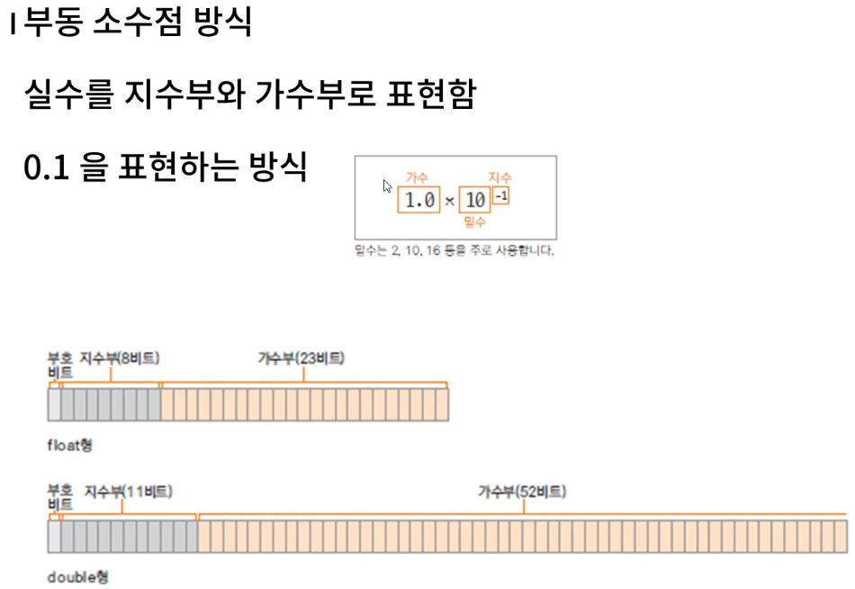

## Chapter 2

#### 보수
보수란? 보충해주는 수를 의미한다. 예를 들어 10진수에서 6의 보수는 4, 5의 보수는 5 이다. 10이 되도록 보중해주는 수라는 의미이다.

#### 컴퓨터에서 음수를 표현하는 방법
2의 보수를 사용하여 음수를 표현할 수 있다. 2의보수는 1의 보수에 1을 더한 값을 의미한다. 

- 1의 보수 : 0000 1000 (8) -> 1111 0111
- 2의 보수 : 1111 0111 -> 1111 1000 (-8)
- 0000 1000(8) + 1111 1000(-8) = 1(날라감) 0000 0000 ( 0 ) 

#### 변수
- 변수는 변하는 수를 의미합니다. 
- 변수를 선언한다는 것은 해당 자료형의 크기만큼의 메모리를 사용하겟다는 것입니다. 메모리의 위치를 변수 이름으로  참조

#### 문자자료형
내부적으로 비트의 조합으로 표현된다. 

- 인코딩 : 각 문자에 따른 특정한 숫자 값(코드값)을 부여
- 디코딩 : 숫자값을 원래 문자로 변환

##### 문자세트
문자세트 : 문자를 위한 코드값들을 정해 놓은 세트
아스키(ASCII) : 1바이트로 영문자, 숫자, 특수문자 등을 표현함
유니코드(Unicode) : 한글과 같은 복잡한 언어를 표현하기 위한 표준 인코딩 UTF-8, UTF-16이 대표적

> 문자를 변수에 저장하면? 문자에 해당하는 코드값이 저장됨

#### 실수
- 실수는 double가 기본이고 float를 사용할때는 f,F를 붙여줘야한다. 
- 실수를 표현할때는 부동소수점 방식을 사용한다.
- 부동소수점 방식은 약간의 오차가 발생할 수 있음.


#### 자료형 없이 변수 사용하기(자바10)

지역변수 자료형 추론(local variable type inference) : 변수에 대입되는 값을 보고 컴파일러가 추론

```java
var num = 10;
var dNum = 10.0;
var str = "hello";
```

#### 상수와 리터럴
상수(constant) : 변하지 않는 수
리터럴(literal) : 프로그램에서 사용되는 모든 숫자, 값, 논리값
모든 리터럴은 상수풀(constant pool)에 저장되어 있음. 상수풀에 저장될때 정수는 int, 실수는 double로 저장됨

#### 진수 표현

```java
public class BinaryTest {

	public static void main(String[] args) {
		int num = 10;
		int bNum = 0B1010; // 2진수
		int oNum = 012; // 8진수
		int xNum = 0XA; // 16진수
		
		System.out.println(num);
		System.out.println(bNum);
		System.out.println(oNum);
		System.out.println(xNum);
	}

}
```

