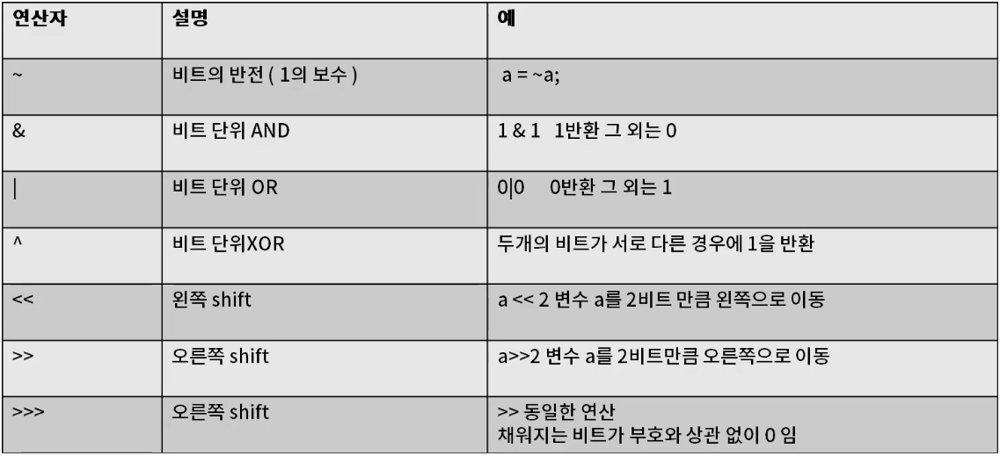
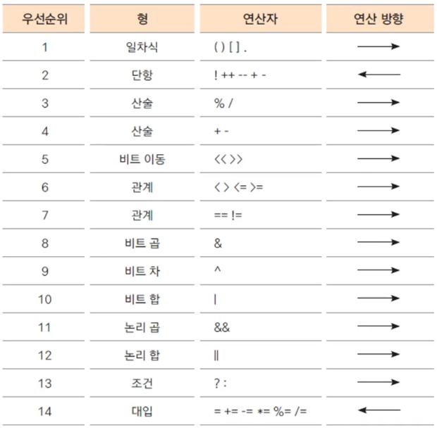

## Chapter 3

#### 단락회로 평가(short circuit evaluationation)
- 논리곱(&&)은 두항이 모두 true일때만 true 일경우에만 true 이기 때문에 앞의 항이 false이면 뒤항의 결과를 평가 하지 않아도 false 임
- 논리합(||)은 두항이 모두 false일 때만 false이기 때문에 앞의 항이 true이면 뒤항의 결과를 평가하지 않아도 true 임.

#### 비트연산자

#### 연산자 우선순위

